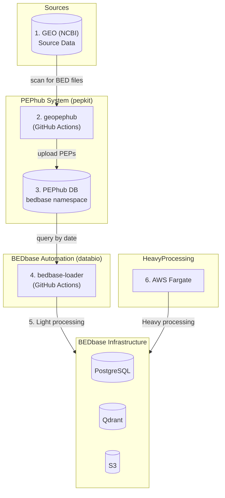

# BEDbase Data Loading

This document describes how BEDbase stays up to date with new BED files from public repositories.

## Data Loading Steps

1. **GEO publishes new data** — Researchers deposit BED files (ChIP-seq peaks, ATAC-seq regions, etc.) to NCBI GEO
2. **geopephub scans GEO** — Every 2 days, [pepkit/geopephub](https://github.com/pepkit/geopephub) GitHub Actions scans GEO for new projects containing BED-like files
3. **geopephub uploads to PEPhub** — Matching projects are uploaded as PEPs to the [`bedbase` namespace](https://pephub.databio.org/bedbase) in PEPhub
4. **bedbase-loader queries PEPhub** — Daily, [databio/bedbase-loader](https://github.com/databio/bedbase-loader) GitHub Actions queries PEPhub for recently updated projects
5. **Light processing runs** — Files are downloaded, validated, and inserted into PostgreSQL/S3 (fast, no heavy computation)
6. **Heavy processing runs** — AWS Fargate runs statistics, generates embeddings, and indexes to Qdrant (slow, compute-intensive)

## Architecture Diagram



## Data Sources

### GEO (Gene Expression Omnibus)

GEO is the primary source of BED files. NCBI's GEO database contains genomic datasets including ChIP-seq peaks (narrowPeak, broadPeak), ATAC-seq accessibility regions, DNase-seq hypersensitivity sites, and other genomic interval data.

### PEPhub and the `bedbase` Namespace

PEPhub (https://pephub.databio.org) serves as a metadata intermediary between GEO and BEDbase. The key component is the **`bedbase` namespace** — a curated subset of GEO containing only projects with BED-like files.

#### How the `bedbase` Namespace is Populated

The `bedbase` namespace is populated by **[geopephub](https://github.com/pepkit/geopephub)**, a tool maintained by the pepkit organization (separate from bedbase). This runs as a GitHub Actions workflow in the geopephub repository:

**Workflow:** `bedbase_uploader.yml` (runs every 2 days at 10:00 UTC)

```bash
geopephub run-queuer --target bedbase --period 2
geopephub run-uploader --target bedbase
```

**What geopephub does:**

1. **Queuer** — Scans GEO for new projects containing BED-like files (narrowPeak, broadPeak, BED) using geofetch's Finder module
2. **Uploader** — Downloads metadata via GEOfetch and uploads PEPs to PEPhub under the `bedbase` namespace
3. **Checker** — Verifies upload success and retries failures

This means:
- The `bedbase` namespace is **not** managed by the bedbase project itself
- It's managed by the pepkit organization via geopephub
- BEDbase (via bedbase-loader) is a **consumer** of this namespace, not the producer

#### PEPhub Namespaces

| Namespace | URL | Contents | Updated by |
|-----------|-----|----------|------------|
| `geo` | https://pephub.databio.org/geo | All GEO projects (~99% of GEO) | geofetch (weekly) |
| `bedbase` | https://pephub.databio.org/bedbase | BED-file projects only | geopephub (every 2 days) |

## bedbase-loader Repository

The [databio/bedbase-loader](https://github.com/databio/bedbase-loader) repository contains the GitHub Actions workflows that pull data from the `bedbase` namespace and load it into BEDbase infrastructure.

| Workflow | Schedule | Purpose |
|----------|----------|---------|
| `upload_cron.yml` | Daily 18:00 UTC | Fetch new GEO samples from last 3 days |
| `upload_cron_series.yml` | Daily 18:00 UTC | Fetch new GEO series from last 3 days |
| `update_genomes.yml` | Weekly (Tuesdays) | Sync genome info from Refgenie |
| `update_umap.yml` | Manual | Regenerate UMAP visualizations |

Configuration: See [`config.yaml`](https://github.com/databio/bedbase-loader/blob/master/config.yaml) in the bedbase-loader repo.

## Phase 1: Light Processing (GitHub Actions)

The daily workflows run `bedboss geo upload-all` with the `--lite` flag:

```bash
bedboss geo upload-all \
  --start-date <3 days ago> --end-date <today> \
  --geo-tag samples --lite \
  --bedbase-config config.yaml --outfolder /tmp/out
```

**What light processing does:**

1. Query PEPhub for GSE projects updated in the time window
2. Skip already-processed projects (via database flags)
3. Download metadata and BED files
4. Validate file format and genome
5. Insert records to PostgreSQL and upload files to S3
6. Flag project as ready for heavy processing

## Phase 2: Heavy Processing (AWS Fargate)

After light processing, heavy processing runs on AWS Fargate via a scheduled task using the [bedboss Docker image](https://github.com/databio/bedboss/blob/main/Dockerfile):

```bash
bedboss reprocess-all --bedbase-config config.yaml --outfolder /tmp/out --limit 100
```

**What heavy processing does:**

1. Quality control (bedqc) — validate file integrity, region counts, region widths
2. Statistics (bedstat) — calculate GC content, TSS distances, genomic feature percentages
3. Embeddings (region2vec) — generate vector embeddings for semantic search
4. Qdrant indexing — upload embeddings to vector database
5. Flag file as fully processed

## Infrastructure

BEDbase uses: PostgreSQL (metadata, processing status), Qdrant (vector embeddings), and S3-compatible storage (files). See [BEDbase Configuration](./how-to-configure.md) for details.

## Related Documentation

- [databio/bedbase-loader](https://github.com/databio/bedbase-loader) — Automation repo with workflows and config
- [databio/bedboss](https://github.com/databio/bedboss) — Processing pipeline CLI
- [pepkit/geopephub](https://github.com/pepkit/geopephub) — Populates the `bedbase` namespace in PEPhub
- [BEDboss CLI Reference](../bedboss/usage.md) — Full command documentation
- [How to Upload GEO Data](../bedboss/how-to/upload-geo-data.md) — Manual upload guide
- [BEDbase Configuration](./how-to-configure.md) — Config file format
