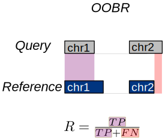
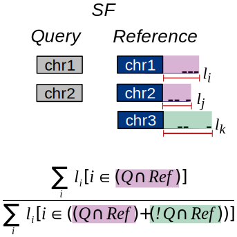
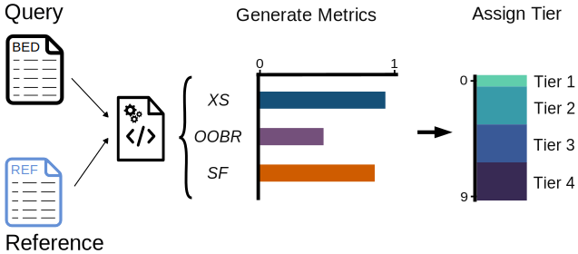

# Reference genome compatibility

Reference genome compatibility is one of the features of BEDbase. Each file that is uploaded to the database is 
being processed by BEDboss pipline that allows to calculate reference genome compatibility with multiple reference genomes.

On the bedbase UI user can find comparison of the BED compatibility with most popular reference genomes.

Compatibility is assessed by 3 criteria: 

- **XS** (Sensitivity/Recall of Chrom Names), 
- **OOBR** (Sensitivity/Recall of Chrom Lengths),
- **SF** (Specificity of Chrom Names with Respect to Sequence Lengths).

After these 3 main statistics are calculated, the tiers are assigned by taking into consideration each score.

The tiers are:

- **TIER 1**: Excellent
- **TIER 2**: Good
- **TIER 3**: Medium
- **TIER 4**: Poor

---

### 🟢 Quantitatively Assess Name Overlaps (XS)

True Positive (TP): Sequence name is in both the query and the reference

False negative (FN): Sequence name is in the query but not in the reference.

---

### 🟢 Out of Bounds Regions (OOBS)

True Positive (TP): Query region is contained within the reference sequence

False Negative (FN): Query region extends beyond the reference sequence

----
### 🟢 Sequence Fit (SF)

Sequence fit is similar to the concept of precision where P=TP/(TP+FP) and we define:

True Positive (TP): Sequence Name in Query is within the Reference

False Positive (FP): Sequence Name is within the Reference but NOT within the Query.

However, we must also consider the *lengths* of each region as well.

----
### 🟣 Assigning  Tiers

Finally, tiers are assigned based on the combination of how well each query file ranks for XS, OOBR, and SF.

## ℹ️ References:
- BEDBoss tutorial of assessing reference genome compatibility can be found here: [Reference genome validator tutorial](../../../bedboss/tutorials/python/ref_genome_tutorial/)
