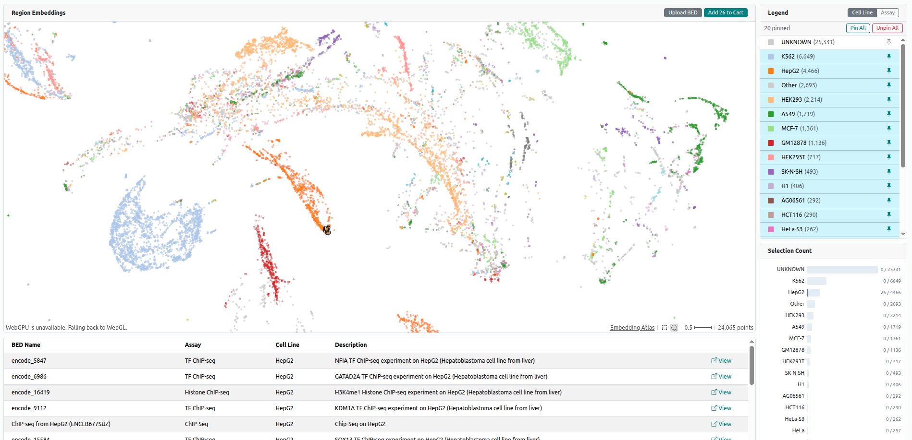

# Embedding Visualization (UMAP)

The UMAP Visualizer at [bedbase.org/umap](https://bedbase.org/umap) provides an interactive 2D scatter plot of all BED files in BEDbase, projected into a shared embedding space.

Each point on the plot represents one BED file. Points that are close together are genomically similar — their underlying genomic regions overlap more than those of distant points.

## How embeddings are generated

BED file embeddings are computed using the [Region2Vec](../../geniml/tutorials/use-pretrained-region2vec-model.md) model, which encodes each BED file as a numeric vector capturing the genomic content of its regions. [UMAP](https://umap-learn.readthedocs.io/en/latest/) is then applied to reduce these high-dimensional vectors to 2D for visualization.

The UMAP data is regenerated automatically on a scheduled basis to incorporate newly added BED files. See [BEDbase Loader](../bedbase-loader.md) for details.

## Using the visualizer

- **Toggle lasso selection**: Click the lasso icon tin bottom right to enable lasso selection. 
Then select a group of points by drawing a freeform shape around them, This will select all points of interest, 
will show information about the selected points in the table below, and will allow you to add them to a bed cart.
- **Select (Pin) Cell line/ Assay**: Click the pin all or separate pin icon sin the top right of the `legend` window to 
to visualize only the points of a specific cell line or assay. This will help you to find similar files for a specific cell line or assay.
- **Upload your own BED file**: Click the `Upload your own BED file` button in the top right to upload your own BED file and visualize it in the UMAP. 
This will allow you to see how your file compares to the files in BEDbase, and to find similar files.

## What the clusters reveal

BED files from similar experiments (e.g., ATAC-seq in the same cell line, or ChIP-seq for the same transcription factor) tend to cluster together. Outliers or isolated points may indicate unusual file content or missing metadata.

## Related

- [Region2Vec embeddings](../../geniml/tutorials/use-pretrained-region2vec-model.md) — the model behind the embeddings
