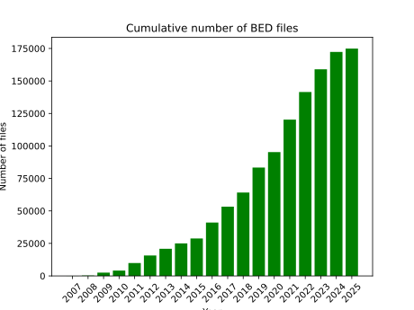

# Plot total number of bed files in GEO database.

All [GEO](https://www.ncbi.nlm.nih.gov/geo/) bed files are related to GSM (samples) and samples are related to GSE (series).

All projects (series) are downloaded and served in PEPhub: [https://pephub.databio.org/bedbase](https://pephub.databio.org/bedbase). 
So the easiest way to count total number of bed files in 
GEO is to count the number of samples under `bedbase` namespace.
Important to note, that one sample can have multiple project, that's why we need to count distinct samples.

To do so we can use sql query:
```sql
select EXTRACT(YEAR FROM b.submission_date) AS year,
	count(distinct a.sample_name) from samples as a join projects as b on a.project_id = b.id 
	where b.namespace='bedbase' 
	group by EXTRACT(YEAR FROM b.submission_date)
	order by year;
```

It is a heavy query, that will take a while to run. (up to 3 minutes)

This will give you the number of samples per year.
e.g.
```text
year	count
2007	47
2008	197
2009	2260
2010	1608
2011	5800
2012	5796
2013	5154
2014	4145
2015	3800
2016	12242
2017	12238
2018	10876
2019	19227
2020	11886
2021	24966
2022	21280
2023	17458
2024	13348
2025	2602
```


After you have a csv with the number of samples per year, you can use it to plot the number of samples per year.

```python
import pandas as pd
import matplotlib.pyplot as plt

data = pd.read_csv("geo2025_06.csv")

data["summary"] = data["count"].cumsum()
data["year_str"] = data["year"].astype(str)


fig, ax = plt.subplots()
plt.xticks(rotation=45)
ax.bar(data["year_str"], 
       data["summary"], 
       label=data["year_str"], 
       color="green")

ax.set_xlabel('Year')
ax.set_ylabel('Number of files')
ax.set_title('Cumulative number of BED files')


fig.savefig('./bed_geo_2025_06_summary.svg')
```

### The output plot: 



